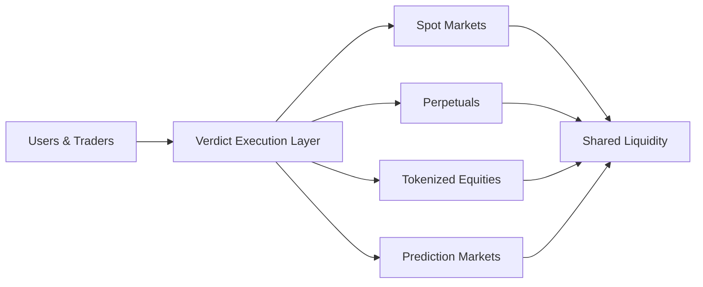
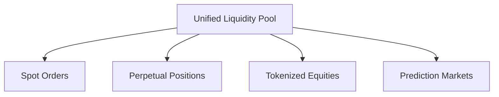
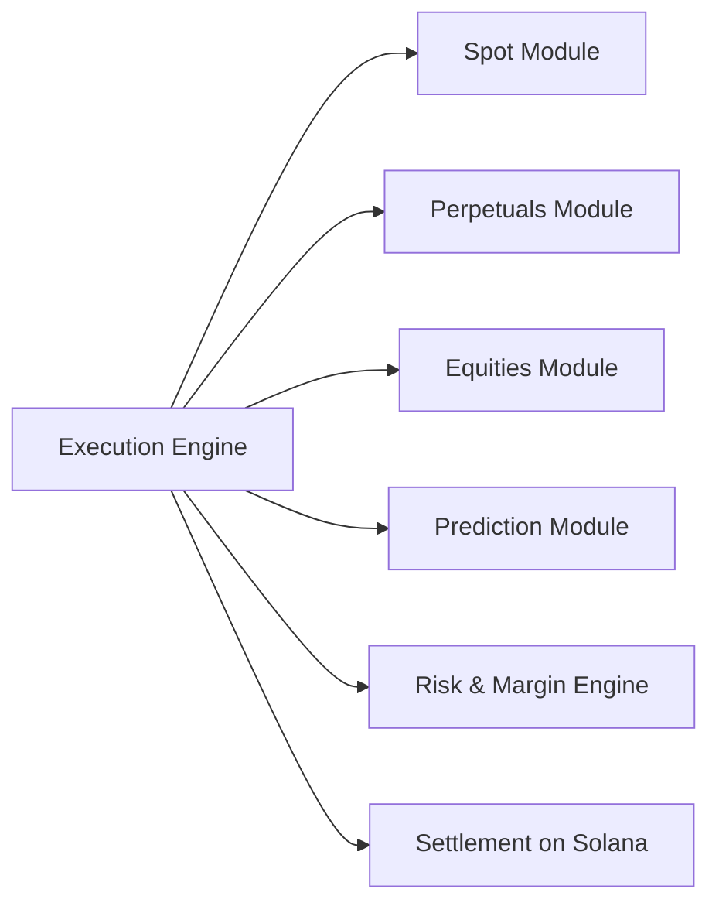
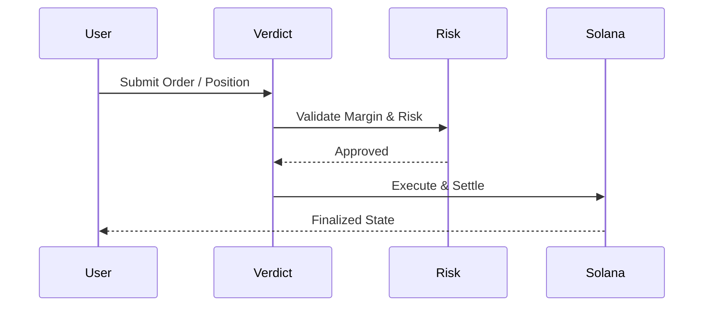

# Verdict

**Verdict is a unified, Solana-native execution environment** for global markets.

We are building a single execution layer that brings together:
- Spot assets
- Perpetual futures
- Tokenized equities
- Prediction markets

All under one composable, high-performance system native to Solana.

---

## Why Verdict Exists

Solana markets are fragmented.

Each market type lives on a separate protocol, with isolated liquidity and inconsistent execution. This fragmentation leads to:
- Inefficient liquidity utilization
- Higher slippage
- Complex user flows
- Limited composability for builders

**Verdict unifies these markets into one execution environment.**

---

## Verdict at a Glance

---

## What Verdict Is

Verdict is **not just an exchange**.

It is a **shared execution layer** where multiple market types coexist, compose, and settle natively on Solana.

Verdict provides:
- Unified execution logic across markets
- Shared liquidity where possible
- Consistent risk and margin handling
- A single interface for users and developers

---

## Core Design Principles

### 1. Solana-Native by Design

Verdict is built directly for Solana’s execution model:
- Parallel execution
- High throughput
- Low latency
- Fast finality

No EVM abstractions.  
No compatibility layers.  
Pure Solana-native execution.

---

### 2. Unified Liquidity Model

Liquidity is not isolated per product.
Markets share depth where possible to improve execution quality and capital efficiency.

---

### 3. Modular Market Architecture

Each market is modular, but:
- Execution is unified
- Risk is shared
- Settlement is consistent

---

### 4. Composability First

Verdict is designed as an execution primitive rather than a standalone application.

This allows:
- DeFi protocol integrations
- Strategy automation
- On-chain agents
- External applications to route orders through Verdict

Builders don’t integrate individual markets.  
They integrate **Verdict** as a unified execution layer.

---

## High-Level Execution Flow

---

## Project Status

Verdict is currently in **early-stage development**.

This profile acts as:
- The public identity of the Verdict project
- A high-level overview of the system vision and architecture
- A reference point for future development updates

Dedicated code repositories will be created and published as development progresses.

---

## Open Development Approach

Verdict follows a pragmatic development approach:
- Architecture and system direction are communicated publicly
- Technical details are shared progressively
- Core infrastructure may remain private during early stages for security and stability

Open-source components will be introduced over time.

---

## Scope & Focus

Verdict focuses on:
- Execution infrastructure, not frontend UX
- Market unification, not isolated trading venues
- Composability, not closed systems

Applications, interfaces, and strategy layers are expected to be built **on top of** the Verdict execution layer.

---

## Links

- Website: https://verdict.fi  
- Terminal: https://terminal.verdict.fi  
- X / Twitter: https://x.com/Verdictfi  
- GitHub: https://github.com/Verdictfi
---

## Disclaimer

Verdict is experimental software under development.

Nothing here constitutes financial advice, investment solicitation, or a guarantee of future functionality.

